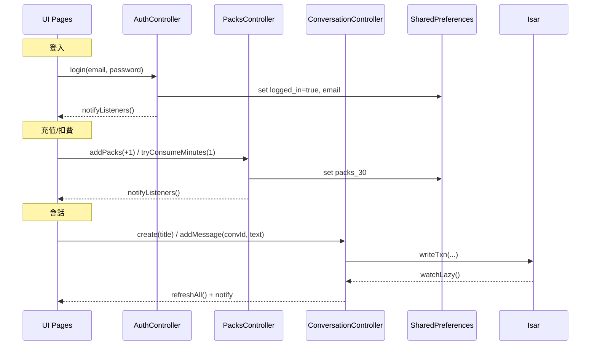

# AIMentai（Flutter）設計文件（完整）

> 面向：前端/客戶端工程師、產品、QA  
> 技術棧：Flutter（Dart）、Provider（ChangeNotifier）、Isar（本地資料庫）、SharedPreferences、speech_to_text、intl、in_app_purchase（預留）  
> 語系：預設 `zh_TW`

---

## 1. 專案概覽

AIMentai 是一款以**語音對話**為核心的情緒陪伴 App。核心體驗：

1. 在 **SessionPage** 點擊錄音鍵 → 開始**1 分鐘**對話（可暫停/恢復）。  
2. 對話過程**即時中文轉寫**並以「透明流式對話框」呈現。  
3. 倒數結束自動結算**套餐時長**（目前：每 30 分鐘為 1 組）。  
4. 對話摘要在 **ConversationListPage** 以**日期分組**的卡片堆疊方式展示，可跨日滑動、快速回到今天、左滑刪除。

整體採用**UI / Controller / Repository / DataSource** 分層，可替換數據層（之後接入雲端或真實金流只需替換 Repository）。本地持久化使用 **Isar**，支援觀察變化、快速查詢與離線使用。

---

## 2. 架構總覽

### 2.1 分層與責任
- **Presentation（UI）**：頁面與元件，僅負責展示與觸發操作，不直接碰資料存取。
- **Controllers（ChangeNotifier）**：集中管理可觀察狀態，封裝業務流程。
- **Domain（Entities / Repositories）**：純抽象與領域模型，無第三方實現細節。
- **Data（Repositories Impl / DataSources）**：本地存儲 Isar / SharedPreferences 的具體實現。

### 2.2 目錄結構
```
lib/
├─ app/
│   ├─ di.dart                 # 依賴注入與全域初始化（含 intl zh_TW）
│   └─ app_providers.dart      # MultiProvider：注入 Controllers
├─ domain/
│   ├─ entities/
│   │   └─ conversation.dart
│   └─ repositories/
│       └─ conversation_repository.dart
├─ data/
│   ├─ datasources/
│   │   ├─ local_auth_ds.dart  # SharedPreferences: 登入
│   │   ├─ local_packs_ds.dart # SharedPreferences: 套餐
│   │   └─ local_db.dart       # Isar 實例管理
│   ├─ models/
│   │   └─ db_models.dart      # Isar Collections: ConversationDb / MessageDb
│   └─ repositories/
│       ├─ auth_repository_impl.dart
│       ├─ packs_repository_impl.dart
│       └─ conversation_repository_impl.dart
├─ presentation/
│   ├─ controllers/
│   │   ├─ auth_controller.dart
│   │   ├─ packs_controller.dart
│   │   └─ conversation_controller.dart
│   └─ pages/
│       ├─ guest_start.dart
│       ├─ auth.dart
│       ├─ session.dart
│       ├─ conversation_list.dart
│       └─ user_profile.dart
└─ assets/
    └─ images/robot.svg
```

### 2.3 依賴與環境
`pubspec.yaml`（核心）
```yaml
dependencies:
  provider: ^6.0.5
  shared_preferences: ^2.3.2
  isar: ^3.1.0
  isar_flutter_libs: ^3.1.0
  path_provider: ^2.1.4
  intl: ^0.19.0
  speech_to_text: ^7.3.0
  flutter_svg: ^2.0.9
  in_app_purchase: ^3.2.0   # 預留金流

dev_dependencies:
  build_runner: ^2.4.6
  isar_generator: ^3.1.0
```
生成 Isar 代碼：
```bash
flutter pub run build_runner build --delete-conflicting-outputs
```

---

## 3. 全域初始化（DI / Providers）

### 3.1 DI 初始化流程（`app/di.dart`）
1. 初始化本地化（避免 `LocaleDataException`）：
   ```dart
   await initializeDateFormatting('zh_TW', null);
   Intl.defaultLocale = 'zh_TW';
   ```
2. 初始化 Controllers：
   ```dart
   await Future.wait([auth.init(), packs.init()]); // SharedPreferences
   await conversation.init(); // Isar + watchChanges 綁定
   ```

### 3.2 Providers（`app/app_providers.dart`）
```dart
MultiProvider(
  providers: [
    ChangeNotifierProvider.value(value: DI.auth),
    ChangeNotifierProvider.value(value: DI.packs),
    ChangeNotifierProvider.value(value: DI.conversation),
  ],
  child: child,
)
```

---

## 4. 狀態與資料流

### 4.1 Auth（登入狀態）
- **資料來源**：SharedPreferences（`logged_in: bool`, `email: String`）
- **Controller**：`AuthController`
  - `loggedIn`, `email`
  - `init()`：讀取本地
  - `login(email, password)`：寫入本地（目前測試帳號 `test/test`）
  - `logout()`：清除登入態

### 4.2 Packs（套餐計費）
- **資料來源**：SharedPreferences（`packs_30: int`）
- **Controller**：`PacksController`
  - `packs30`, `totalMinutes = packs30 * 30`
  - `addPacks(delta)`：充值或扣一組（30 分）
  - `tryConsumeMinutes(minutes)`：目前策略為**按 30 分鐘粒度扣**（例如 1 分鐘也會扣 1 組）

> 可改為「分鐘累計至 30 再扣 1 組」的策略，僅需調整 `tryConsumeMinutes`。

### 4.3 Conversation（會話與訊息）
- **資料來源**：Isar
  - `ConversationDb`：`id, title, lastMessage, updatedAt, messageCount, dayKey(y/m/d)`（`dayKey` 有索引）
  - `MessageDb`：`id, conversationId, createdAt(索引), text(雜湊索引), fromUser`
- **Repository**：`ConversationRepositoryImpl`
  - `allDaysAsc()` → 日期列表（升序、去重）
  - `listByDay(dayKey)` → 當日會話列表（`updatedAt` 降序）
  - `watchChanges()` → 任意寫入變動觸發通知
  - `create(title)`、`addMessage(convId, text, fromUser)`、`deleteConversation(id)`
- **Controller**：`ConversationController`
  - `days: List<DateTime>`（升序）
  - `byDay: Map<DateTime, List<Conversation>>`
  - `init()`：`refreshAll()` + 監聽 `watchChanges()` 自動刷新
  - `create()` / `deleteConv()` 封裝呼叫

---

## 5. 頁面規格（功能 / 設計 / 跳轉）

### 5.1 GuestStartPage（啟動/入口）
**目的**：顯示入口操作與帳戶狀態。  
**功能**
- 右上角：`登入 / 註冊` 或 `User Profile`（依 `auth.loggedIn` 顯示/跳轉）
- 中上插畫：`assets/images/robot.svg`（`flutter_svg`）
- 右上角狀態籤：`剩餘套餐：${packs.packs30}`
- 主按鈕「立即開始」：
  - 未登入 → 彈窗「需要登入」→ `AuthPage`
  - 已登入 && 套餐=0 → 彈窗「次數不足」→ `UserProfilePage`（購買）
  - 已登入 && 套餐>0 → `SessionPage`
- 次按鈕「對話列表」→ `ConversationListPage`

**設計**
- 深色背景 `#0C1C24`；前景淺色字；尺寸用相對值（`h/w`）。
- SVG 有 `placeholderBuilder`，載入時顯示 Loading。

**跳轉**
- `AuthPage` / `UserProfilePage` / `SessionPage` / `ConversationListPage`

---

### 5.2 AuthPage（登入頁）
**功能**
- 輸入帳號/密碼（測試：`test/test`）。
- 點擊登入：
  - `await context.read<AuthController>().login(email, password);`
  - 成功 → `pushAndRemoveUntil(GuestStartPage)`
  - 失敗 → SnackBar `登入失敗`。

**設計**
- 登入時按鈕禁用 + `CircularProgressIndicator`。
- TextField 支援 iOS 自動填寫、密碼遮蔽。

**跳轉**
- 成功回到 `GuestStartPage`（頂部狀態改為 User Profile）。

---

### 5.3 SessionPage（語音對話）
**功能**
- **錄音主鍵**：點擊開始/停止；首次點擊開始**1:00**倒數。
- **即時轉寫**：`partialResults: true`，在透明流式對話框即時顯示；偵測停頓（`pauseFor: 2800ms`）或 `finalResult` 時提交段落。
- **暫停/恢復**：暫停顯示面板——「本次剩餘 mm:ss」+「帳戶剩餘分鐘」。  
- **倒數結束**：`packs.tryConsumeMinutes(1)`（目前：按 30 分鐘為 1 組扣）。
- **DEBUG**：右上角扣 1 組（測試）。

**設計**
- 背景為**全屏**「藍/橙彩雲」流動（不影響解析度），橙色占比隨倒數增加；前景內容置於 `SafeArea` 內。

**語音參數（建議）**
```dart
listenMode: ListenMode.dictation
partialResults: true
cancelOnError: true
pauseFor: Duration(milliseconds: 2800)
listenFor: Duration(seconds: 60)
localeId: 'zh-TW' // 強制中文
```

**穩定性**
- 任一回調先判斷 `if (!mounted) return;`；`dispose()` 中停止錄音/計時/動畫。
- 解決過去的 `SingleTickerProviderStateMixin but multiple tickers were created`：正確管理多個 `AnimationController` 的建立與釋放。

**跳轉**
- 返回 → `GuestStartPage`。

---

### 5.4 ConversationListPage（對話清單）
**功能**
- 讀取 `ConversationController.days / byDay` 展示會話。
- `SliverAppBar pinned` 工具列：
  - 「今天」→ 跳至最新一天（陣列最後）
  - 日期滑桿：`0=最早 → N=最新`，`divisions = days.length - 1`
  - 目前日期：`DateFormat('yyyy/MM/dd (EEE)', 'zh_TW')`
- 內容：
  - 每日一個分組標題（`yyyy/MM/dd EEE`）
  - 其下為**卡片堆疊**（最近在上），左滑刪除。
- 下拉刷新：`RefreshIndicator → controller.refreshAll()`
- 空狀態：提示 + 右上「新對話」建立。

**設計/效能**
- 使用**幀後節流**更新當前所屬日期：`_scheduleScrollUpdate() → addPostFrameCallback → _updateCurrentDayByViewport()`。
- 正確 `dispose()` ScrollController，避免記憶體滲漏。

**跳轉**
- 點卡片（預留）→ 詳情/復盤頁（未實作，可後續加）。

---

### 5.5 UserProfilePage（個人中心）
**功能**
- 顯示帳號（首字母頭像、email、登入狀態）。
- 顯示套餐：`packs.packs30` 與 `packs.totalMinutes`。
- **購買 30 分鐘（NT$50）**：目前為 **trick**（`packs.addPacks(1)`）；已預留 `in_app_purchase` 初始化、產品查詢、`purchaseStream` 監聽與 `_buy30Min()`。
- **退出登入**：`auth.logout()` → `pushAndRemoveUntil(GuestStartPage)`。

**設計**
- 暗色卡片 + 對比色 CTA。
- BottomSheet 說明購買資訊與權益。

**跳轉**
- 返回 → 前頁；登出 → `GuestStartPage`。

---

## 6. 導航關係（Mermaid）

```mermaid
flowchart TD
  A[GuestStartPage] -->|登入/註冊| B(AuthPage)
  A -->|對話列表| C(ConversationListPage)
  A -->|User Profile| D(UserProfilePage)
  A -->|立即開始(需登入&有套餐)| E(SessionPage)

  B -->|登入成功| A

  D -->|購買(Trick +1)| D
  D -->|退出登入| A

  C -->|點卡片(預留)| F[會話詳情(未實作)]

  E -->|返回| A
```

---

## 7. 數據流（Mermaid）



---

## 8. 本地存儲細節

### 8.1 SharedPreferences（鍵）
- `logged_in: bool`
- `email: String`
- `packs_30: int`

### 8.2 Isar Collections
```dart
@collection
class ConversationDb {
  Id id = Isar.autoIncrement;
  late String title;
  String lastMessage = '';
  DateTime updatedAt = DateTime.now();
  int messageCount = 0;

  @Index()
  late DateTime dayKey; // DateOnly: DateTime(y,m,d)
}

@collection
class MessageDb {
  Id id = Isar.autoIncrement;
  late int conversationId;
  @Index()
  late DateTime createdAt;
  @Index(type: IndexType.hash)
  late String text;
  bool fromUser = true;
}
```
> 修改模型後需重新跑 `build_runner` 生成。

---

## 9. 穩定性與錯誤處理

- **setState() after dispose**：所有非同步/動畫回調前檢查 `if (!mounted) return;`；`dispose()` 內停止錄音/計時/動畫，解除監聽。
- **多 Ticker 問題**：每個 `AnimationController` 只綁一次 `vsync`，並在 `dispose()` 中 `dispose()`。
- **LocaleDataException**：在 `DI.init()` 先行 `initializeDateFormatting('zh_TW')` 並設定 `Intl.defaultLocale`。
- **滾動效能**：時間軸高亮計算採「幀後節流」，避免每像素都重算。
- **IAP**：購買流程中任何狀態改變需 `completePurchase`；目前為 `trick` 不走真實扣款。

---

## 10. 無障礙與 i18n

- `Intl.defaultLocale = 'zh_TW'`，日期格式使用 `DateFormat(..., 'zh_TW')`。
- `SvgPicture.asset` 設定 `semanticsLabel`；主要 CTA 有可讀性標籤與足夠尺寸。
- 對比度、動效速度、觸控區域覆蓋 iOS 導航區域等細節已處理。

---

## 11. 測試計畫（要點）

- **登入流**：`test/test` 成功；登出後「立即開始」提示登入。
- **套餐流**：套餐為 0 時引導購買；充值 +1 後可進入會話；倒數結束正確扣除。
- **SessionPage**：錄音開始/暫停/恢復/結束；即時中文轉寫；結束提交段落。
- **列表頁**：日期滑桿、回到今天、下拉刷新、左滑刪除、跨日滾動；空狀態正常。
- **本地化**：無 `LocaleDataException`；日期顯示繁中。
- **資源**：`robot.svg` 正常載入。
- **穩定性**：離開頁面不再出現 `setState() called after dispose()`。

---

## 12. 後續擴充（Roadmap）

1) **Face ID / 生物辨識登入**（iOS：`local_auth`）  
   - AuthPage 增加「使用 Face ID 登入」：
     ```dart
     final auth = LocalAuthentication();
     final ok = await auth.authenticate(localizedReason: '使用 Face ID 登入', options: const AuthenticationOptions(biometricOnly: true));
     if (ok) context.read<AuthController>().login(storedEmail, storedToken);
     ```
   - 與 Keychain 整合保存 token（之後接後端）。

2) **真實 IAP**  
   - `UserProfilePage` 的購買按鈕改為 `_buy30Min()`；`purchaseStream` 成功後 `packs.addPacks(1)`；後端校驗收據。

3) **會話詳情/搜尋/備份**  
   - 新增 ConversationDetailPage（消息列表分頁）。  
   - 關鍵字搜尋（基礎 `contains` + hash index；高階可接 SQLite FTS5 或後端）。  
   - 匯出/匯入（Isar 檔或 JSON）。

4) **扣費策略優化**  
   - 由「每次會話固定扣 1 組」 → 「按實際分鐘累計，滿 30 扣 1 組」。

---

## 13. 建置與指令

- 產生 Isar 代碼：
  ```bash
  flutter pub run build_runner build --delete-conflicting-outputs
  ```
- iOS 端如新增原生依賴：
  ```bash
  cd ios && pod install
  ```
- 常見清理：
  ```bash
  flutter clean && flutter pub get
  ```

---

## 14. 安全與隱私

- 本地資料：會話與消息儲存在 Isar。若需加密，可使用 `encryptionKey`（搭配 `flutter_secure_storage` 保存金鑰）。
- 登入狀態：目前為本地測試帳號；接入後端後需使用安全存儲保存 Token。
- 麥克風權限：僅在 SessionPage 使用；離開頁面立即停止錄音並釋放資源。

---

## 15. 關鍵決策摘要

- 採用 **Provider + Controller**：降低頁面與資料耦合，便於替換數據層與測試。
- 使用 **Isar** 作為本地資料庫：性能佳、易於觀察與分組聚合，適合對話/消息結構化資料。
- 初始化 **intl zh_TW**：確保日期顯示一致且不拋異常。
- 所有尺寸走**相對布局**：適配不同 iPhone/Android 螢幕尺寸。

---

**版本**：v1.0（與當前程式碼一致）  
**維護**：更新任何資料模型需同步更新 Repository 與 Controller，並重新生成 Isar 代碼。
